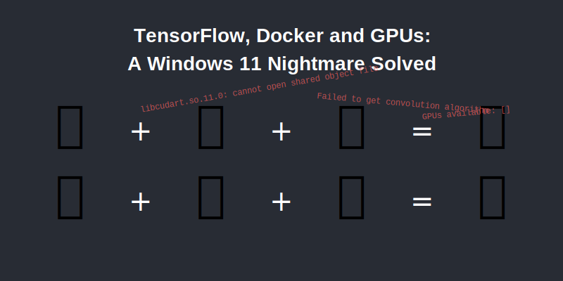

# TensorFlow GPU Docker Setup



This repository contains Docker configuration for running TensorFlow with GPU support. The setup includes optimizations for WSL2 environments and includes all necessary packages for data science and deep learning tasks.

## Prerequisites

- [Docker](https://docs.docker.com/get-docker/) installed
- [NVIDIA GPU](https://www.nvidia.com/en-us/geforce/) with [compatible drivers](https://www.nvidia.com/Download/index.aspx)
- [NVIDIA Container Toolkit](https://docs.nvidia.com/datacenter/cloud-native/container-toolkit/install-guide.html) installed
- If using WSL2: [Properly configured GPU passthrough](https://docs.nvidia.com/cuda/wsl-user-guide/index.html)

## Quick Start

```bash
# Build the image
docker build -t tensorflow-gpu-custom -f Dockerfile.gpu .

# Run with GPU support
docker run --gpus all -it tensorflow-gpu-custom

# Run the comprehensive GPU test
docker run --gpus all -it tensorflow-gpu-custom python /app/test_gpu.py
```

## Using Pre-built Container from GitHub

This repository publishes a pre-built container to GitHub Container Registry, which you can use directly:

```bash
# Pull the pre-built image
docker pull ghcr.io/mrgkanev/tensorflow-gpu-custom:latest

# Run with GPU support
docker run --gpus all -it ghcr.io/mrgkanev/tensorflow-gpu-custom

# Run the comprehensive GPU test
docker run --gpus all -it ghcr.io/mrgkanev/tensorflow-gpu-custom python /app/test_gpu.py
```

## Included Packages

The Docker image includes the following packages:
- TensorFlow 2.11.0 with GPU support
- NumPy
- Pandas
- scikit-learn
- CUDA and cuDNN libraries

## Detailed Setup Instructions

### 1. Build the Docker Image

Save the `Dockerfile.gpu` and `test_gpu.py` in your project directory, then build the image:

```bash
docker build -t tensorflow-gpu-custom -f Dockerfile.gpu .
```

This command creates a Docker image named `tensorflow-gpu-custom` based on the content of `Dockerfile.gpu`.

### 2. Run the Container with GPU Access

To run the container with GPU support:

```bash
docker run --gpus all -it tensorflow-gpu-custom
```

The `--gpus all` flag is what enables GPU access from within the container.

### 3. Verifying GPU Access

Once inside the container, you can verify GPU access with these methods:

#### Option 1: Quick verification
```python
import tensorflow as tf
print(tf.config.list_physical_devices('GPU'))
```

#### Option 2: Run the comprehensive test script
```bash
python /app/test_gpu.py
```

This script performs:
- GPU detection and environment checks
- Matrix multiplication benchmarks comparing CPU vs GPU speed
- Simple neural network training test

## GPU Test Script

The included `test_gpu.py` script provides comprehensive testing of your GPU setup:

```bash
# Run directly from host
docker run --gpus all -it tensorflow-gpu-custom python /app/test_gpu.py

# Or run from inside the container
python /app/test_gpu.py
```

The test script will:
1. Check if TensorFlow can detect your GPU
2. Run performance benchmarks using matrix multiplication
3. Train a simple neural network to verify end-to-end functionality
4. Provide detailed diagnostics if GPU is not detected

## Using with PyCharm

To use this Docker container with PyCharm:

1. **Configure Docker integration in PyCharm:**
   - Go to Settings/Preferences → Build, Execution, Deployment → Docker
   - Add your Docker connection

2. **Configure Python Interpreter:**
   - Go to Settings/Preferences → Project → Python Interpreter
   - Click the gear icon → Add → Docker
   - Select your Docker server and the `tensorflow-gpu-custom` image

3. **Fix common TensorFlow errors:**
   - If you encounter optimizer errors with LSTM models (like `KeyError: 'The optimizer cannot recognize variable lstm/lstm_cell/kernel:0'`), use the legacy optimizers:
     ```python
     # Change this:
     from tensorflow.keras.optimizers import Adam
     
     # To this:
     from tensorflow.keras.optimizers.legacy import Adam
     ```
   - Configure GPU memory growth at the start of your script:
     ```python
     gpus = tf.config.list_physical_devices('GPU')
     for gpu in gpus:
         tf.config.experimental.set_memory_growth(gpu, True)
     ```
   - See the included `tensorflow_pycharm_fix.py` script for a complete example

4. **Configure Run Configuration:**
   - Create a new Run Configuration
   - Set the Docker container as the target environment
   - Set the working directory to your project folder
   - Map your local project directory to a directory in the container

## Common Issues and Troubleshooting

### GPU Not Detected

If you see `GPUs available: []` or errors about CUDA, check:

1. **NVIDIA Driver Installation**
   ```bash
   # On host machine
   nvidia-smi
   ```
   
2. **NVIDIA Container Toolkit Installation**
   ```bash
   # On Linux host
   dpkg -l | grep nvidia-container-toolkit
   
   # Install if missing
   sudo apt-get install -y nvidia-container-toolkit
   sudo systemctl restart docker
   ```

3. **Test with NVIDIA's Base Container**
   ```bash
   docker run --gpus all --rm nvidia/cuda:11.6.2-base-ubuntu20.04 nvidia-smi
   ```

### WSL2-Specific Issues

1. **Install NVIDIA Drivers for WSL**
   - Download the [NVIDIA CUDA driver for WSL](https://developer.nvidia.com/cuda/wsl) 
   - Install on your Windows host (not inside WSL)

2. **Enable GPU in Docker Desktop**
   - Open Docker Desktop Settings
   - Go to Resources → WSL Integration
   - Check "Enable NVIDIA GPU support in WSL 2"

3. **Configure WSL**
   - Create or edit `%USERPROFILE%\.wslconfig` file in Windows with:
     ```
     [wsl2]
     kernelCommandLine = systemd.unified_cgroup_hierarchy=0
     ```

4. **Restart WSL**
   ```
   wsl --shutdown
   ```

### Performance Optimization

1. **Configure Memory Growth**
   ```python
   gpus = tf.config.list_physical_devices('GPU')
   for gpu in gpus:
     tf.config.experimental.set_memory_growth(gpu, True)
   ```

2. **Monitor GPU Usage**
   ```bash
   # From host or another terminal
   watch -n 0.5 nvidia-smi
   ```

## Docker Commands Quick Reference

- Build the image: `docker build -t tensorflow-gpu-custom -f Dockerfile.gpu .`
- Run with GPU access: `docker run --gpus all -it tensorflow-gpu-custom`
- Run with volume mount: `docker run --gpus all -v $(pwd):/workspace -it tensorflow-gpu-custom`
- Check existing images: `docker images`
- Check running containers: `docker ps`
- Execute commands in running container: `docker exec -it CONTAINER_ID bash`

## Sample Training Code

```python
import numpy as np
import tensorflow as tf
from tensorflow.keras import layers
from tensorflow.keras.optimizers import Adam

# Check for GPU
gpus = tf.config.list_physical_devices('GPU')
print(f"GPUs available: {gpus}")

# Optional: Enable memory growth
for gpu in gpus:
    tf.config.experimental.set_memory_growth(gpu, True)

# Create a simple model
model = tf.keras.Sequential([
    layers.Dense(128, activation='relu', input_shape=(10,)),
    layers.Dense(64, activation='relu'),
    layers.Dense(1, activation='sigmoid')
])

# Compile the model
model.compile(optimizer=Adam(), loss='binary_crossentropy', metrics=['accuracy'])

# Generate some fake data
X = np.random.random((1000, 10))
y = np.random.randint(2, size=(1000, 1))

# Train the model
model.fit(X, y, epochs=5, batch_size=32)
```

## Notes

- The Docker image is based on TensorFlow 2.11.0-gpu for optimal compatibility
- The container includes proper environment setup for CUDA paths
- If you encounter memory issues, adjust batch sizes or enable memory growth

## Fixing Common TensorFlow Errors

### KeyError with Optimizers

If you see this error:
```
KeyError: 'The optimizer cannot recognize variable lstm/lstm_cell/kernel:0'
```

This happens because TensorFlow 2.11.0 has both experimental and legacy optimizers. The experimental optimizers have compatibility issues with certain layer types (especially LSTM).

**Solution:**
1. Use legacy optimizers:
```python
# Change this
from tensorflow.keras.optimizers import Adam

# To this
from tensorflow.keras.optimizers.legacy import Adam
```

2. Make sure your input shapes are correct:
```python
# Check input shape expectations
print(model.input_shape)
```

3. Fix shape mismatches in your data. If your error mentions:
```
Model was constructed with shape (None, 30, 1) but was called on input with incompatible shape (64, 1, 1)
```

Ensure your data matches the expected dimensions:
```python
# Reshape your data to match expected input
X = X.reshape(batch_size, sequence_length, features)
```

4. See the provided `tensorflow_pycharm_fix.py` script for complete examples
