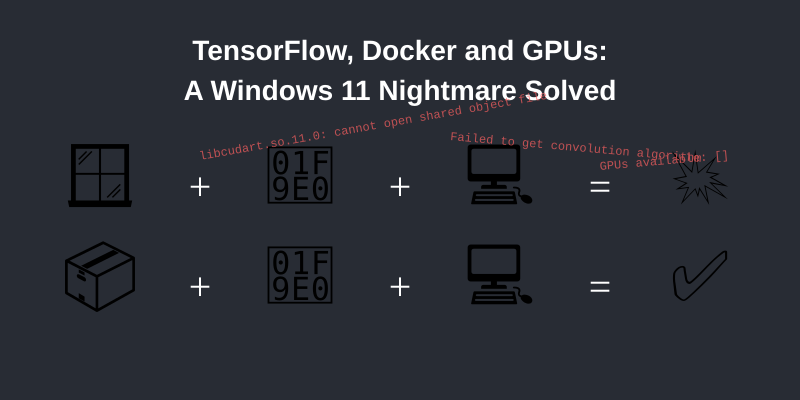

# TensorFlow GPU Docker Setup



A ready-to-use Docker environment for TensorFlow GPU workloads. It is based on `tensorflow/tensorflow:2.16.1-gpu-jupyter` and adds common data-science, computer-vision, monitoring, and PyTorch packages.

## What's included

- TensorFlow 2.16.1 with GPU and Jupyter Lab support
- CUDA libraries supplied by the upstream TensorFlow image
- Legacy Keras 2 compatibility (`TF_USE_LEGACY_KERAS=1` and `tf-keras`)
- PyTorch, NumPy, pandas, scikit-learn, Matplotlib, OpenCV, Graphviz, and OpenPyXL
- GPU diagnostics, benchmarks, and a live performance monitor
- Docker Compose configuration with NVIDIA GPU access, a pip cache, and ports for Jupyter Lab and TensorBoard

## Prerequisites

- Docker Engine and the Docker Compose plugin
- An NVIDIA GPU with a compatible host driver
- [NVIDIA Container Toolkit](https://docs.nvidia.com/datacenter/cloud-native/container-toolkit/latest/install-guide.html)
- On Windows/WSL2, Docker Desktop with WSL integration and NVIDIA GPU support enabled

Confirm that Docker can see the GPU before building this image:

```bash
nvidia-smi
docker run --rm --gpus all nvidia/cuda:12.4.1-base-ubuntu22.04 nvidia-smi
```

## Quick start

Build and start the development container:

```bash
docker compose up --build -d
```

The Compose setup mounts the repository into `/app`, so changes to your project files are immediately visible in the container. Open a shell with:

```bash
docker compose exec tensorflow-gpu bash
```

Run GPU diagnostics:

```bash
docker compose exec tensorflow-gpu python /app/scripts/check_gpu.py
```

Stop the environment when finished:

```bash
docker compose down
```

`docker-compose` can be used in place of `docker compose` on older installations.

## Run without Compose

Build the image:

```bash
docker build -t tensorflow-gpu-custom -f Dockerfile.gpu .
```

Run an interactive shell with GPU access and the current directory mounted at `/app`:

```bash
docker run --rm --gpus all -it -v "$PWD":/app tensorflow-gpu-custom bash
```

Or invoke an entrypoint command directly:

```bash
docker run --rm --gpus all tensorflow-gpu-custom --check-gpu
docker run --rm --gpus all tensorflow-gpu-custom --benchmark
docker run --rm --gpus all -p 8888:8888 tensorflow-gpu-custom --jupyter
```

## Use the published image

The default-branch build is published to GitHub Container Registry:

```bash
docker pull ghcr.io/mrgkanev/tensorflow-gpu-custom:latest
docker run --rm --gpus all -it ghcr.io/mrgkanev/tensorflow-gpu-custom:latest --check-gpu
```

## Available container commands

| Command | Purpose |
| --- | --- |
| `--check-gpu` | Prints TensorFlow, CUDA, and detected-GPU information, then runs a small GPU computation. |
| `--benchmark` | Runs the complete TensorFlow benchmark suite. |
| `--jupyter` | Starts Jupyter Lab at `http://localhost:8888` (token: `development`). |
| `--help` | Shows the commands supported by the entrypoint. |

With Compose, Jupyter Lab and TensorBoard ports `8888` and `6006` are already published. The container prints a short GPU status check every time it starts.

## Tools

### GPU diagnostics

```bash
docker compose exec tensorflow-gpu python /app/scripts/check_gpu.py
```

This verifies that TensorFlow was built with CUDA support, lists available GPUs, and executes a tensor operation on the first GPU.

### Benchmarks

Run the full suite (matrix multiplication, CNN training, Transformer attention, and GPU-memory profiling):

```bash
docker compose exec tensorflow-gpu python /app/scripts/tf_benchmark.py
```

Useful variants:

```bash
python /app/scripts/tf_benchmark.py --matrix-only
python /app/scripts/tf_benchmark.py --cnn-only
python /app/scripts/tf_benchmark.py --attention-only
python /app/scripts/tf_benchmark.py --no-mixed-precision --no-xla
```

Full-suite results are written to `benchmark_results_<timestamp>.json` in `/app`.

### Performance monitor

```bash
docker compose exec tensorflow-gpu python /app/scripts/performance_monitor.py
```

The monitor renders a live terminal dashboard and appends metrics to `performance_log.jsonl`. Change the interval or log location as needed:

```bash
python /app/scripts/performance_monitor.py --interval 2 --log-file /app/metrics.jsonl
python /app/scripts/performance_monitor.py --log-file /app/metrics.jsonl --report
```

## TensorFlow notes

The image sets `TF_FORCE_GPU_ALLOW_GROWTH=true` to let TensorFlow allocate GPU memory on demand. You can also configure it in an application before creating tensors or models:

```python
import tensorflow as tf

for gpu in tf.config.list_physical_devices("GPU"):
    tf.config.experimental.set_memory_growth(gpu, True)
```

For existing projects that need Keras 2 behavior, the image enables legacy Keras by default. If an optimizer compatibility error still occurs, import the legacy optimizer explicitly:

```python
from tensorflow.keras.optimizers.legacy import Adam
```

## Troubleshooting

1. Run `nvidia-smi` on the host. If it fails, install or update the NVIDIA driver.
2. Run the NVIDIA CUDA test shown in [Prerequisites](#prerequisites). If it fails, install and configure NVIDIA Container Toolkit, then restart Docker.
3. Run `docker compose logs tensorflow-gpu` and the included GPU diagnostic script.
4. For WSL2-specific setup and additional failure modes, see [TROUBLESHOOTING.MD](TROUBLESHOOTING.MD).

## License

This project is distributed under the [MIT License](LICENSE).
